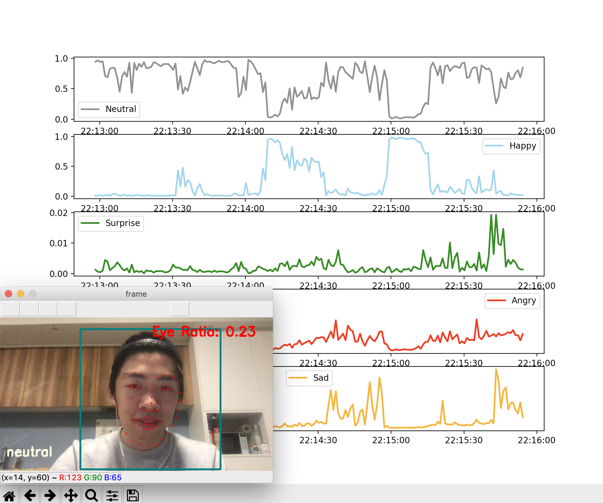

# Real-time Emotion Monitor using Webcam
Monitoring your emotions in real-time using webcam and trigger alarm sounds when your stress level is high.
It can be used con-currently with Zoom or Google Meet Video Conference.   
Simple stress-management tool for WFH.

---
## Prerequisites
- [Fast.ai library](https://docs.fast.ai/install.html)   
- [Dlib](https://www.pyimagesearch.com/2017/03/27/how-to-install-dlib/)  
- [OpenCV](https://pypi.org/project/opencv-python/)  
- python3

## Detect facial expression from live video
1. Install all the above prerequisites and python packages listed in the *requirements.txt* file
2. In the *liveVideoFrameRead.py* file, set variable `path=` to your project directory.
3. run `python liveVideoFrameRead.py` , with the following optional tags.

Additional tags: 
`--save-video` to save webcam video to the output folder  
`--save-csv` to save expression predictions, their probability tensor to a csv file  
`--camera_id 1` to set the webcam id, default to 1 for MacBook  
`--low-fps` to lower frame refresh rate to reduce the amount of real-time computation  

Example:
* `python liveVideoFrameRead.py --save-csv --low-fps` will run webcam at low fps rate and save the prediction 
results to a CSV file to the output folder.

## Reference
https://github.com/jy6zheng/FacialExpressionRecognition